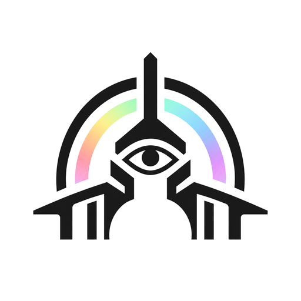
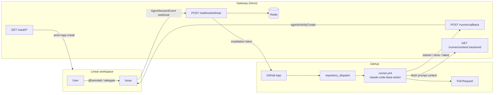

<div align="center">
  <picture>
    <source media="(prefers-color-scheme: dark)" srcset="docs/assets/heimdall-dark.png">
    
  </picture>

  <h1>Heimdall</h1>

  <p><strong>The bridge between Linear and Claude Code.</strong><br>
  Mention <code>@heimdall</code> on a Linear issue → Claude Code runs in GitHub Actions → a pull request opens → progress streams back into the issue as native agent activities.</p>

  <p>
    <a href="https://github.com/vinicius33/heimdall/actions/workflows/docker.yml"></a>
    <a href="LICENSE"></a>
  </p>
</div>

## How it works

There is no persistent agent server. A thin gateway receives Linear webhooks and dispatches jobs to GitHub Actions, where [`claude-code-base-action`](https://github.com/anthropics/claude-code-base-action) runs Claude Code inside the target repo. All state lives in Redis.



- **First response in seconds** — the gateway acks the session and posts a thought before any GitHub call.
- **Repo routing** — map Linear team keys to repos with `HEIMDALL_ROUTES`; serve multiple Linear workspaces from one deployment with per-workspace tables; override per issue with `[repo=owner/name]` in the description.
- **Follow-ups** — reply on the issue and the same branch/PR is updated with full conversation context; press stop (or unassign) to cancel the run.
- **Self-healing auth** — Linear OAuth tokens are refreshed automatically before expiry.

## Running the gateway

The gateway is a single stateless HTTP service; everything persistent lives in Redis.

### Docker Compose (bundled Redis)

```sh
cp .env.example .env   # fill in your Linear/GitHub credentials
docker compose up
```

Compose points the gateway at the bundled Redis automatically, so you can leave `REDIS_URL` empty in `.env`.

### Prebuilt image

Images are published to GHCR from `main` and release tags:

```sh
docker run --env-file .env -p 3000:3000 ghcr.io/vinicius33/heimdall:latest
```

Bring your own Redis via `REDIS_URL` (or Upstash REST via `UPSTASH_REDIS_REST_URL` + `UPSTASH_REDIS_REST_TOKEN`).

### From source

```sh
npm install
npm run build
npm start          # or: npm run dev
```

Health check: `GET /healthz`.

## Setting it up end to end

Heimdall needs a Linear OAuth app (the agent), a GitHub App (dispatch + PRs), and a stub workflow in each target repo. The full walkthrough lives in **[docs/SETUP.md](docs/SETUP.md)**; the design and behavior contract is in **[docs/SPEC.md](docs/SPEC.md)**.

Per target repo, it boils down to:

1. Copy [`stubs/heimdall.yml`](stubs/heimdall.yml) to `.github/workflows/heimdall.yml`.
2. Add Actions secrets: `HEIMDALL_CALLBACK_SECRET` and one of `ANTHROPIC_API_KEY` / `CLAUDE_CODE_OAUTH_TOKEN` (Claude usage bills to whoever owns the key — set it org-wide to onboard a whole org at once).
3. Enable "Allow GitHub Actions to create and approve pull requests" and install the GitHub App on the repo.

## Development

```sh
npm test           # jest
npm run typecheck  # tsc -b
npm run lint       # eslint
```

Every feature ships with tests for its critical path — see [CLAUDE.md](CLAUDE.md) for the working conventions.

## License

[MIT](LICENSE)
