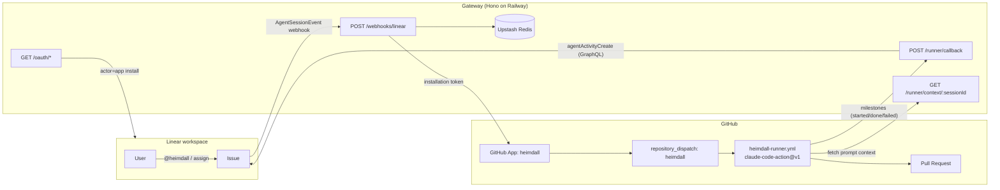
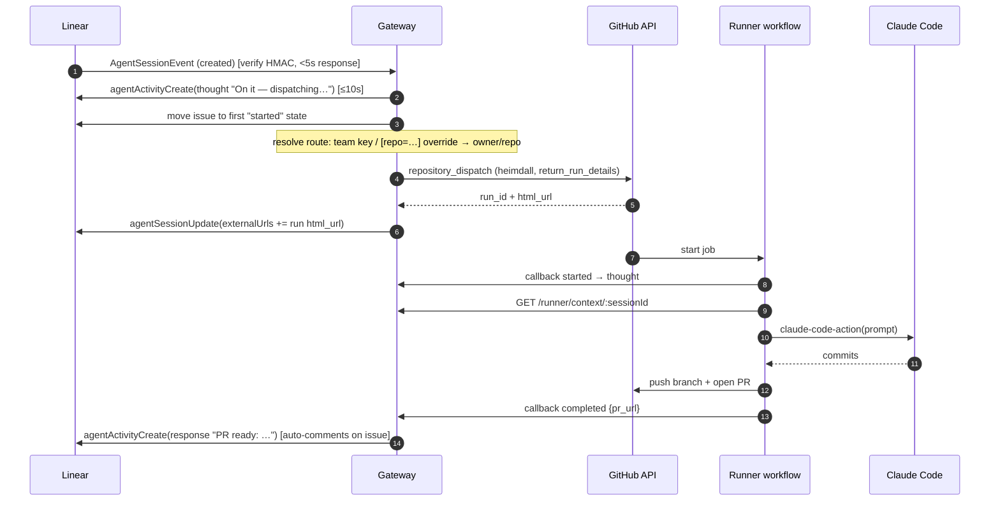

# Heimdall — Linear ↔ Claude Code Agent

**Status:** approved spec, ready for implementation
**Implementer notes:** written for autonomous implementation. Every external fact here was verified against vendor docs (July 2026); source-of-truth links are inline.

## 1. Overview

Heimdall is a Linear agent: mention or assign **@heimdall** on a Linear issue and it clones the mapped GitHub repo, does the work with Claude Code, opens a PR, and reports progress natively in the issue via Linear agent activities. Follow-up replies in the same session continue on the same branch/PR.

There is no persistent agent server. A thin **Gateway** (Hono/TypeScript on Railway, portable to serverless later) receives Linear webhooks and dispatches jobs to **GitHub Actions**, where `anthropics/claude-code-action` runs Claude Code. State lives in **Upstash Redis**.

### Non-goals (v1)

- No Sandcastle / self-managed sandboxes (GitHub Actions _is_ the sandbox).
- No serverless migration yet (design for it: Hono + Redis, no local disk, no long-lived processes).
- No Claude Code session resume across runs (follow-ups reconstruct context; `actions/cache` resume is a stretch goal).
- Single Linear workspace per deployment is acceptable, but keep tokens keyed by workspace id.

## 2. Architecture



**Monorepo layout** (npm workspaces, TypeScript strict, Node 20+, Jest, ESLint + Prettier):

```
heimdall/
├── apps/gateway/                     # Hono service (Railway)
├── packages/linear/                  # Linear GraphQL client: activities, sessions, OAuth
├── packages/github/                  # App auth (installation tokens), dispatch, run status
├── packages/core/                    # shared types, config schema (zod), route resolution
├── .github/workflows/runner.yml      # reusable workflow (workflow_call)
├── stubs/heimdall.yml                # 10-line stub to copy into each target repo
└── docs/SPEC.md
```

## 3. Linear integration (Agents API)

Docs: <https://linear.app/developers/agents>, <https://linear.app/developers/agent-interaction>, <https://linear.app/developers/agent-best-practices>.

### 3.1 OAuth app setup (one-time, manual)

- Create an OAuth app at `linear.app/settings/api/applications/new` with webhooks enabled; name/icon render as the agent (**"Heimdall"**).
- Authorize with **`actor=app`** (creates a dedicated app user in the workspace; requires workspace admin; `admin` scope cannot be combined):

```
https://linear.app/oauth/authorize?client_id=...&redirect_uri=<GATEWAY>/oauth/callback
  &response_type=code&scope=read,write,app:assignable,app:mentionable&actor=app
```

- Gateway `GET /oauth/callback` exchanges the code, queries `viewer { id organization { id } }`, stores the token in Redis keyed by workspace/org id.
- Enable webhook categories in the app config: **Agent session events** (required), **Inbox notifications** and **Permission changes** (recommended).

### 3.2 Webhook contract — `POST /webhooks/linear`

- **Verify** `Linear-Signature`: hex HMAC-SHA256 of the **raw body** with the webhook signing secret, timing-safe compare. Reject if `webhookTimestamp` (UNIX ms) is outside ±60s.
- **Respond within 5 seconds.** Return `200` immediately after verification + persisting the event; process async (fire-and-forget promise is fine on Railway; use `waitUntil` when ported to Workers).
- Events (`type: "AgentSessionEvent"`, full payload shape in §9.3):
  - **`action: "created"`** — new session (mention or assignment). Payload includes `agentSession` (id, issue, comment), `promptContext` (preformatted issue + comments string — **only present on `created`**), `previousComments`, `guidance` (nearest team-specific guidance wins).
  - **`action: "prompted"`** — user follow-up; new message in `agentActivity.body`. **Check `agentActivity.signal` first**: `stop` means cancel the current run (§5.3), `continue`/absent means a normal follow-up.
- Also handle inbox notification `issueUnassignedFromYou` → treat as **stop** (§5.3).

### 3.3 Agent session lifecycle rules (hard requirements)

| Rule                                                 | Value                                                                                                                            |
| ---------------------------------------------------- | -------------------------------------------------------------------------------------------------------------------------------- |
| First activity after `created`                       | **≤ 10 seconds**, or session shows unresponsive → emit an ack `thought` synchronously in the webhook handler, before dispatching |
| HTTP webhook response                                | ≤ 5 seconds                                                                                                                      |
| Idle → `stale`                                       | 30 min without activity (recoverable by emitting another activity)                                                               |
| Session states (Linear-inferred, never set manually) | `pending, active, error, awaitingInput, complete, stale`                                                                         |

Activities are emitted with `mutation agentActivityCreate(input: { agentSessionId, content: { type, ... } })`. Types: `thought`, `action` (tool call + optional result), `elicitation` (ask user), `response` (terminal success), `error` (terminal failure). Terminal `response`/`elicitation`/`error` also auto-post a comment on the issue. `mutation agentSessionUpdate` sets `externalUrls` (link the GitHub run/PR) and `plan`. Exact input shapes are in **§9** — implement `packages/linear` against those, not guesses from prose docs.

Best practices to implement: on delegation, move the issue to the team's first `started` workflow state (query states `filter: { type: { eq: "started" } }`, lowest `position`); self-assign if `delegate` unset; emit `thought` → `action`s → single terminal `response`.

## 4. GitHub integration

### 4.1 GitHub App

Create app **"heimdall"**, permissions: Contents R/W, Pull requests R/W, Issues R/W. Install on all target repos. Gateway mints installation tokens to call the dispatch API. (Personal fallback: a classic PAT with `repo` scope via `GITHUB_PAT` env — support both behind one interface in `packages/github`.)

### 4.2 Dispatch

`POST /repos/{owner}/{repo}/dispatches` with `event_type: "heimdall"`. Constraints: `client_payload` ≤ **10 top-level properties**, total ≤ **64 KB**, workflow file must exist on the default branch. Keep the payload small — the runner fetches the full context from the Gateway:

```jsonc
{
  "event_type": "heimdall",
  "client_payload": {
    "session_id": "…",          // Linear agentSession id (correlation key)
    "issue_id": "ABC-123",
    "branch": "vinicius/abc-123-fix-login",  // Linear issue.branchName
    "kind": "created" | "prompted",
    "callback_url": "https://<gateway>/runner"
  }
}
```

Use `return_run_details: true` on the dispatch call to get `workflow_run_id` + `html_url` back in the 200 response ([GitHub changelog 2026-02-19](https://github.blog/changelog/2026-02-19-workflow-dispatch-api-now-returns-run-ids/)); store the run id in the session record and set it as the session's external URL.

### 4.3 Runner workflow (`.github/workflows/runner.yml`, reusable via `workflow_call`)

Per-repo stub (`stubs/heimdall.yml`, copied into each target repo):

```yaml
name: heimdall
on:
  repository_dispatch:
    types: [heimdall]
jobs:
  run:
    uses: vinicius33/heimdall/.github/workflows/runner.yml@main
    with:
      payload: ${{ toJSON(github.event.client_payload) }}
    secrets: inherit
```

Reusable workflow steps:

1. **Callback `started`** → Gateway posts a `thought` ("picked up by GitHub Actions run …").
2. Checkout default branch; create or check out `client_payload.branch` (follow-ups reuse it).
3. **Fetch context**: `GET {callback_url}/context/{session_id}` (auth header, §4.4) → returns the assembled prompt (Linear `promptContext`, thread history, and for `prompted` runs the diff summary of the existing branch).
4. Run `anthropics/claude-code-action@v1` (**pin an exact version** — the OAuth-token phase bug #676 makes floating tags risky):

```yaml
- uses: anthropics/claude-code-action@v1.x.y
  with:
    prompt: ${{ steps.context.outputs.prompt }}
    claude_code_oauth_token: ${{ secrets.CLAUDE_CODE_OAUTH_TOKEN }} # personal (Max, via `claude setup-token`)
    anthropic_api_key: ${{ secrets.ANTHROPIC_API_KEY }} # work — set exactly one of the two
    claude_args: |
      --max-turns 50
      --allowedTools Edit,Read,Write,Bash(git *),Bash(npm *),Bash(npx *)
```

Required job permissions: `contents: write`, `pull-requests: write`, `issues: write`, `id-token: write` (the action fetches a GitHub OIDC token).

5. Commit if the action didn't, push branch, `gh pr create` (or update the existing PR on follow-ups). PR title from issue: `feat: ABC-123 <issue title>`; body links the Linear issue.
6. **Callback `completed`** with `{ pr_url }` — or **`failed`** with the tail of the action log (an `if: failure()` step).

### 4.4 Runner ↔ Gateway callback protocol

`POST /runner/callback` and `GET /runner/context/:sessionId`, both authenticated with `Authorization: Bearer ${HEIMDALL_CALLBACK_SECRET}` (same secret set as an org/repo Actions secret). Callback body:

```jsonc
{ "session_id": "…", "event": "started" | "progress" | "completed" | "failed",
  "run_url": "…", "pr_url": "…", "message": "…" }  // fields optional per event
```

Gateway maps: `started`→`thought` + `agentSessionUpdate.externalUrls += run_url`; `progress`→`action`; `completed`→`response` (includes PR link; move issue is left to Linear/PR automation); `failed`→`error`.

## 5. Flows

### 5.1 Session created (mention or assign)



### 5.2 Follow-up (`prompted`)

Same pipeline with `kind: "prompted"`: Gateway looks up the session record in Redis (`repo`, `branch`, `pr_url`), dispatches again; the runner checks out the **existing branch**, the context endpoint prepends the conversation so far + `git diff main...branch` summary + the new user message; the run pushes to the same branch so the existing PR updates. Terminal activity: `response` ("Updated the PR: …").

If a `prompted` event arrives for an unknown session (Redis miss — e.g. TTL expiry), emit an `error` activity asking the user to start a fresh mention.

### 5.3 Failure & stop

- Dispatch fails / route unresolved → immediate `error` activity ("no repo mapped for team X — add it to HEIMDALL_ROUTES or use [repo=owner/name]").
- Workflow fails → `failed` callback → `error` activity with log tail + run URL.
- **User stop**: a `prompted` webhook whose `agentActivity.signal == "stop"` is the canonical cancel — Gateway cancels the run (`POST /repos/{o}/{r}/actions/runs/{id}/cancel`) and emits an `error` activity with `reasonCode: "user_stopped"` (there is no agent-side cancel mutation; session status is inferred from activities).
- `issueUnassignedFromYou` inbox notification → same cancel path, final `thought` ("Stopped by unassignment").
- Runs longer than GitHub's 6h job limit are out of scope; `--max-turns` bounds runaway sessions.

## 6. Configuration & state

### 6.1 Gateway env

| Var                                                                      | Purpose                                                                                                                                                                                            |
| ------------------------------------------------------------------------ | -------------------------------------------------------------------------------------------------------------------------------------------------------------------------------------------------- |
| `LINEAR_CLIENT_ID` / `LINEAR_CLIENT_SECRET`                              | OAuth app                                                                                                                                                                                          |
| `LINEAR_WEBHOOK_SECRET`                                                  | HMAC verification                                                                                                                                                                                  |
| `GITHUB_APP_ID` / `GITHUB_APP_PRIVATE_KEY` (or `GITHUB_PAT`)             | dispatch auth                                                                                                                                                                                      |
| `HEIMDALL_CALLBACK_SECRET`                                               | runner ↔ gateway auth                                                                                                                                                                              |
| `HEIMDALL_ROUTES`                                                        | JSON: `{"ENG":"acme/backend","PLAY":"viniciussouza/playground","*":"vinicius33/heimdall-sandbox"}` — Linear **team key** → repo; `*` = catch-all; `[repo=owner/name]` in the issue description overrides |
| `REDIS_URL` **or** `UPSTASH_REDIS_REST_URL` + `UPSTASH_REDIS_REST_TOKEN` | KV — plain TCP Redis (Railway one-click) or Upstash REST; both implement the gateway `KV` interface                                                                                                |

### 6.2 Redis keys

```
ws:{organizationId}:token          → Linear OAuth access token (encrypted at rest is a stretch goal)
session:{agentSessionId}           → { issueId, repo, branch, runId, prUrl, status, updatedAt }  TTL 14d
```

### 6.3 Target repo secrets

`CLAUDE_CODE_OAUTH_TOKEN` **or** `ANTHROPIC_API_KEY`, plus `HEIMDALL_CALLBACK_SECRET`. Org-level secrets for work; repo-level for personal.

## 7. Milestones (implementation order)

1. **M1 — Gateway skeleton**: Hono app, health check, Linear OAuth flow, webhook endpoint with HMAC verify + ack `thought` within deadlines, Redis wiring. _Verify: install into a test workspace, @heimdall a ticket, see the ack thought appear._
2. **M2 — Dispatch + runner**: GitHub App auth, route resolution, `repository_dispatch`, reusable workflow + stub, claude-code-action run, PR creation. _Verify: mention → PR opens on a sandbox repo._
3. **M3 — Status reporting**: callback endpoints, context endpoint, milestone→activity mapping, external run URL on session. _Verify: ticket shows thought → actions → response with PR link._
4. **M4 — Follow-ups + stop**: `prompted` handling (incl. `signal: stop` → cancel run), branch reuse/PR update, unassignment cancel, error paths. _Verify: reply on the session updates the same PR; pressing stop cancels the Actions run._

## 8. Risks / gotchas (read before coding)

- **10-second ack** is the tightest constraint — emit the ack `thought` _inside_ the webhook handler before any GitHub call.
- `client_payload` limits (10 props / 64 KB) — never inline prompt context in the dispatch; always fetch from the Gateway.
- `claude-code-action` OAuth-token phase bug (repo issue #676) — pin an exact release and test the subscription-token path first.
- `repository_dispatch` requires the App/PAT token; the default `GITHUB_TOKEN` cannot trigger it.
- `agentActivityCreate.content` is `JSONObject!` — the server does **not** validate per-type shapes; a typo'd field fails silently in the UI. Type it strictly in `packages/linear` per §9.
- Prompt-injection surface: issue text is untrusted input executed with repo write access. Mitigate with `--allowedTools` (no `WebFetch`/`WebSearch`), review-before-merge (agent never merges), and target-repo choice.

## 9. Linear API schemas (verified against `schema.graphql`, July 2026)

Source: [`linear/linear` SDK `schema.graphql`](https://raw.githubusercontent.com/linear/linear/master/packages/sdk/src/schema.graphql) · [activity content payload doc](https://linear.app/developers/agent-interaction#activity-content-payload)

### 9.1 `agentActivityCreate(input: AgentActivityCreateInput!)`

Input: `agentSessionId: String!`, `content: JSONObject!`, `ephemeral: Boolean` (activity disappears after the next one — use for transient progress), `signal: AgentActivitySignal`, `id: String` (optional UUID).

`content` per type (`body`/`result` are Markdown; server does not enforce these shapes):

| `content.type` | fields                                                     |
| -------------- | ---------------------------------------------------------- |
| `thought`      | `body: string!`                                            |
| `action`       | `action: string!`, `parameter: string!`, `result?: string` |
| `elicitation`  | `body: string!`                                            |
| `response`     | `body: string!`                                            |
| `error`        | `body: string!`, `reasonCode?: string`                     |
| `prompt`       | receive-only (user-generated): `body: string!`             |

### 9.2 `agentSessionUpdate(id: String!, input: AgentSessionUpdateInput!)`

- `externalUrls: [{ label: string!, url: string! }]` — **replaces** the set; use `addedExternalUrls` / `removedExternalUrls: [String!]` for increments (if `externalUrls` is supplied, added/removed are ignored).
- `externalLink: String` — URL of an agent-hosted page for the session.
- `plan: JSONObject` — dynamically updated execution strategy list.
- Only the OAuth app that owns the session may update. Session status enum (read-only, inferred): `pending | active | awaitingInput | complete | error | stale`.

### 9.3 `AgentSessionEventWebhookPayload`

`action!` (`created`/`prompted`), `agentSession!`, `agentActivity?` (present on `prompted`), `promptContext?` (**`created` only**), `previousComments?`, `guidance?` (nearest team-specific rule has highest precedence), `appUserId!`, `oauthClientId!`, `organizationId!`, `type!`, `createdAt!`, `webhookId!`, `webhookTimestamp!` (Unix ms).

### 9.4 Signals (`AgentActivitySignal`)

`auth | continue | select | stop` — carried on activities in both directions. Heimdall must handle **`stop`** on incoming prompts (cancel run, §5.3); `select` pairs with elicitation options; agents may set `signal` on their own activities as an interpretation modifier.
